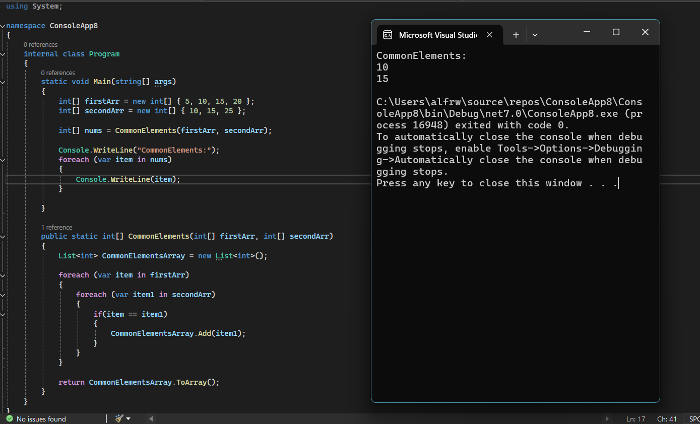

# Challenge 06-A: Find Common Elements in Two Arrays

## Description

Write a function called CommonElements that accepts two arrays of integers as its parameters. Without utilizing any of the built-in methods, the function should return a new array containing the common elements between the two input arrays.

## Whiteboard Image

