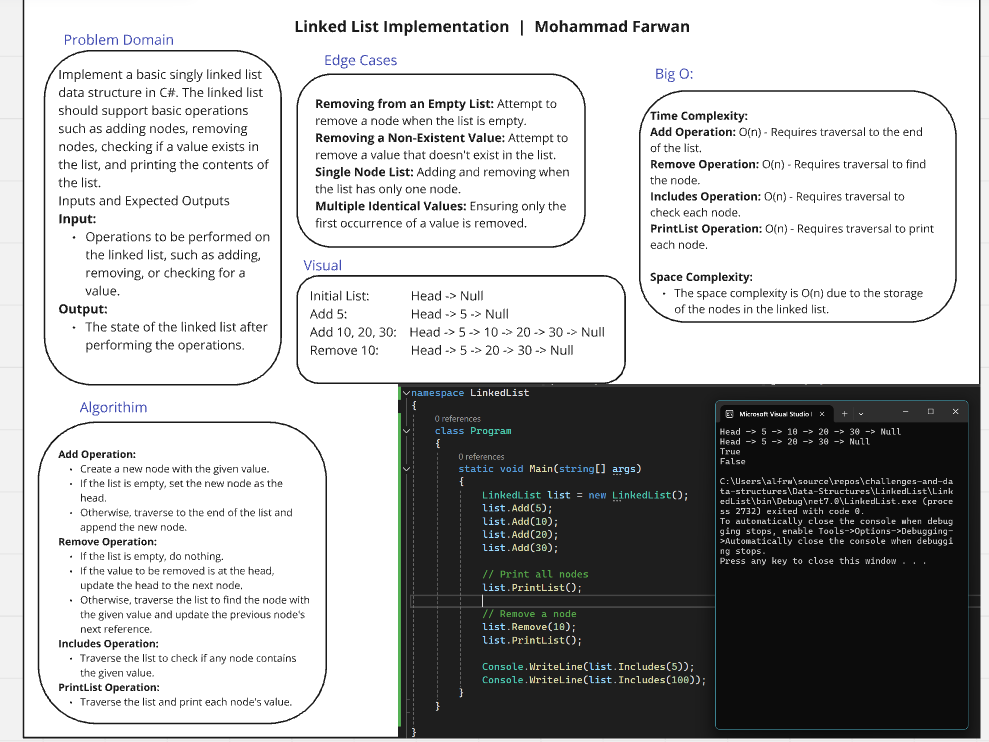

# Whiteboard Challenges

## Table of Contents

### Challenge-1 (A): Array Reversal

### Challenge-1 (B): Most Frequent Number

### Challenge 02: Maximum Value

### Challenge 03: Remove-Middle-Value

### Challenge 04: Insert Value in Middle of Array

### Challenge 05: Find Duplicates in Array

### Challenge 06-A: Find Common Elements in Two Arrays

### Challenge 6-B: Reverse Words

### Linked List Implementation

### Linked List Remove Duplicates

### Linked List Merge Sorted Lists  

### Stack & Queue Implementation

### Stack & Queue: Reverse a Stack using Queue

### Stack Challenge: Delete Middle Element of a Stack 

### Adv-cc 12 [ Min Stack Challenge ]

### Lab-13 Tree Implementation

### Challenge 13

### Challenge 14 [Binary Tree - Second Maximum Value]

### Challenge 15 [ Binary Tree - Sum of leaf n

### Challenge 16 [ Binary Tree - Largest Value at Each Level ] 

### Linked List - Rotate by K

### Binary Tree - Print Right View

