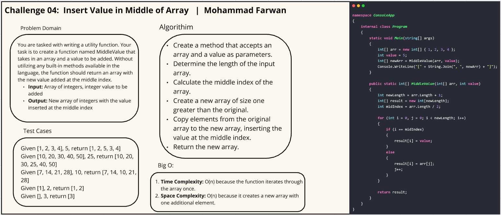

# Challenge 04: Insert Value in Middle of Array

## Description

You are tasked with writing a utility function. Your task is to create a function named MiddleValue that takes in an array and a value to be added. Without utilizing any built-in methods available in the language, the function should return an array with the new value added at the middle index.

## Whiteboard Image

